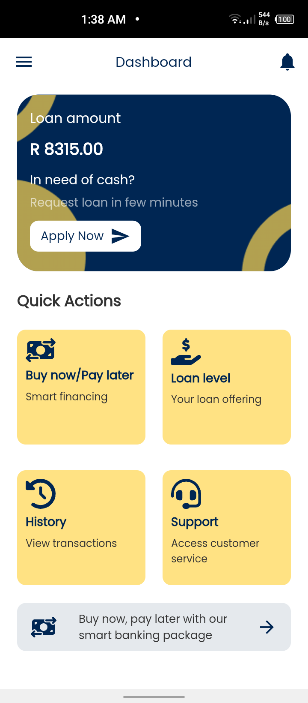
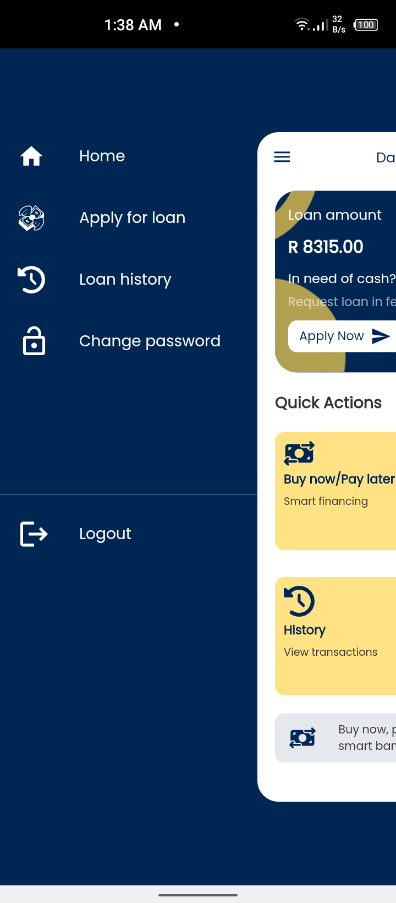

# enviro_bank_ltd

A mobile app for Enviro Bank Limited (Developed with Flutter).

## Screenshots

| 1                                         | 2                                         |
|-------------------------------------------|-------------------------------------------|
|  |  |

[//]: # ()
[//]: # (| 3 | 4|)

[//]: # (|------|-------|)

[//]: # (|||)
## Getting Started

For help getting started with Flutter development, view the
[online documentation](https://docs.flutter.dev/), which offers tutorials,
samples, guidance on mobile development, and a full API reference.

## How to use

**Step 1**

Download or clone this repo by using the link below
```
https://github.com/enoch-aik/enviro_bank_ltd.git
```

**Step 2**

Go to project root and execute the following command in console to get the required dependencies:

```
flutter pub get
```

## Hide Generated Files

In-order to hide generated files, navigate to `Android Studio` -> `Preferences` -> `Editor` -> `File Types` and paste the below lines under `ignore files and folders` section:

### Features:

* User authentication
* Loan request
* Dashboard

### Libraries & Tools Used

* [Dio](https://github.com/flutterchina/dio) (API calls)
* [GoRouter](https://github.com/flutter/packages/tree/main/packages/go_router) (Routing)
* [Riverpod](https://github.com/rrousselGit/river_pod) (State Management)
* [Shared Preferences](https://github.com/flutter/plugins/tree/master/packages/shared_preferences/shared_preferences) (Persistent storage)
* [Flutter SVG](https://github.com/dnfield/flutter_svg) (Svg)
* [Google fonts](https://github.com/material-foundation/google-fonts-flutter) (fonts)
* [Modal Progress HUD](https://github.com/mmcc007/modal_progress_hud)
* [Json Serialization](https://github.com/dart-lang/json_serializable)

### Folder Structure
Here is the core folder structure which flutter provides.

```
enviro_bank_ltd/
|- android
|- build
|- ios
|- lib
|- screenshots
|- test
```
Here is the folder structure we have been using in this project

```
lib/
|- app/
   |- models/
   |- config
|- core/
   |- api/
   |- validators/
   |- providers/
   |- helpers/
   |- db/
|- src/
   |- constants/
   |- res/
   |- router/
   |- screens/
      |- auth/
        |- login/
        |- signup/
      |- change_password/
      |- coming_soon
      |- error
      |- home
      |- loan
      |- onboarding
      |- splash
   |- widgets
|- export
|- main.dart
```

Now, lets dive into the lib folder which has the main code for the application.
```
1- constants - All the application level constants are defined in this directory with-in their respective files. This directory contains the constants for `custom icons`,and `baseUrls`.
2- helpers - Contains the helpers of the project, includes codes for current date, text formatter, keyboard focus, theme selector,platform detector.
3- models - This folder contains all the models of the application. 
4- providers - Contains store(s) for state-management of the application, to connect the reactive data of the application with the UI.
5- services - All basic services such as network services(API calls), image picker, location services .
6- res - All themes, colors, primary swatch and styles used in the app.
7- validators - This contains validators for logging-in and signing up to the application. 
8- main - This is the starting point of the application. All the application level configurations are defined in this file i.e, theme, routes, title, orientation etc.
9- routes - This contains all the named routes of the application (Navigation 2.0).
10- screens - This directory contains all the UI for the app
```

